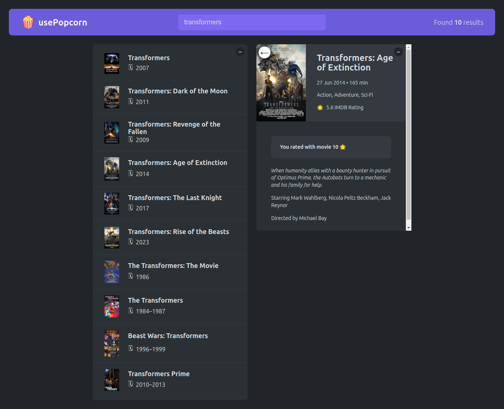

# 🍿 usePopcorn

Welcome to **usePopcorn** — a dynamic React-based movie app that makes it easy to find, manage, and rate your favorite movies. Dive into the world of cinema with a sleek interface and powerful features that let you search for movies, read detailed information, and keep track of what you've watched.



## ✨ Features

- **🔍 Search Movies:** Instantly search for movies using keywords.
- **📜 Movie Details:** Get detailed information, including IMDb ratings and runtime.
- **⭐ User Ratings:** Rate the movies you've watched and see your stats.
- **📋 Watchlist:** Keep track of movies you want to watch or have watched.
- **🎯 User Stats:** View your average rating and the total number of movies you've rated.

## 🛠 Technologies Used

- **React:** Frontend library for building user interfaces.
- **React Hooks:** Efficient state management with `useState` and `useEffect`.
- **API Fetching:** Retrieves movie data and ratings from external APIs.
- **HTML & CSS:** Creates a responsive and appealing user interface.

## 🚀 Getting Started

Clone the repository and install dependencies:

- ```bash
  git clone https://github.com/AnasHany2193/usePopcorn.git
  ```
- ```bash
  cd usePopcorn
  ```
- ```bash
  npm install
  ```

Start the app in development mode:

- ```bash
  npm start
  ```

Your app will be running at [http://localhost:3000](http://localhost:3000).

## 📦 Available Scripts

- **`npm start`:** Runs the app in development mode.
- **`npm test`:** Launches the test runner.
- **`npm run build`:** Builds the app for production.

## 🌟 Demo

Check out the live demo [here](https://usepopcorn-2193.netlify.app/).
